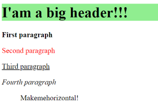

# Loops-Functions

1. На [HTML-сторінці](task1.html) є ненумерований список з id="list", який складається із 5 елементів. У модальному вікні необхідно послідовно вивести вміст:

   1 першого елемента списку

   2 останнього елемента списку

   3 другого елемента списку

   4 четвертого елемента списку

   5 третього елемента списку

2. Для [HTML-сторінці](task2.html). Напишіть скріпт, який за допомогою засобів DOM простилізує сторінку так як показано на картинці.
   

3. Напишіть скріпт, який за допомогою засобів DOM створить для порожньої HTML-сторінки таку структуру з тегів і їх атрибутів.

```html
<body>
  <main class="mainClass check item">
     <div id="myDiv">
         <p>First paragraph</p>
     </div>
 </main>
</body>
```

4. До [HTML-сторінки](task4.html) додати скрипт, яки реалізує вивід даних із полів при кліку на кнопку "Надіслати" в `<div class="out"></div>`.

5. З [HTML-сторінки](task5.html):

   1. вибрати всі теги із класом circle;
   2. перебрати кожен елемент, і вибрати його data-anim значення;
   3. вибране значення додати як клас за допомогою classList до цього елемента;
   4. перевірити чи застосувались анімації.

6. До [HTML-сторінки](task6.html) дадати скрипт який буде розраховувати ціну в залежності від вибраного кольору (можна використати `data-price` атрибути градієнтів або кольорів). Придумати додаткові варіації параметрів, які можуть впливати на ціну, реалізувати логіку для них.

⭐⭐⭐
(Ускладнене. Задача не оцінюється. Для тих, кому хочеться поробити ще щось)
Зробити електронний годинник у такому стилі.


